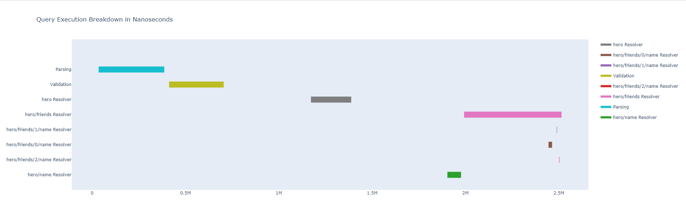

This repository provides a tool to generate a visualization of a graphql query execution using the tracings returned from the graphql-query as part of the [Apollo Tracing Implementation](https://github.com/apollographql/apollo-tracing). The plotly pen source python package is used to create the chart to visualize the execution step breakdown.

